# Getting Started with Ktor

Thank you for creating a Ktor project! Let’s see how to make use of it.

The goals of this document are to:

1. Describe in detail the steps you should follow to open and run your project. 
2. Provide a series of tasks you can attempt to familiarize yourself with Ktor. 

Unless explicitly stated we don’t assume you have changed any settings in the [Ktor Project Generator](https://start.ktor.io/). Nor do we assume that you have added any optional plugins.

## Unpacking and Running the Project 

Below are detailed directions for building and running the project. Please choose whichever option is most suitable.

<details>

<summary>Unpacking and Running the Project on macOS</summary>

### Unpacking and Running the Project on macOS

This is the process to unpack, build and run the project from the command line on macOS. The descriptions below assume that:

1. You have created and downloaded a project called *ktor-sample-app*.
2. This has been placed in a folder called *myprojects* in your home directory.

Please alter the names and paths as required to match your own setup.

First, change your folder to *myprojects* in the home directory and unpack the archive created by the Ktor Project Generator:

```console
tmp> cd ~/myprojects
myprojects> unzip ktor-sample-app.zip -d ktor-sample-app
```

Change into the new directory and make the *gradlew* Gradle helper script executable:

```console
myprojects> cd ktor-sample-app
ktor-sample-app> chmod +x ./gradlew
```

Finally build and run the application:

```console
ktor-sample-app> ./gradlew build
ktor-sample-app> ./gradlew run
```

The output from the final command should look like this:

```console
ktor-sample-app> Task :run
2023-07-05 16:00:51.735 [main] INFO ktor.application - Autoreload is disabled because the development mode is off.
2023-07-05 16:00:51.966 [main] INFO ktor.application - Application started in 0.256 seconds.
2023-07-05 16:00:52.094 [DefaultDispatcher-worker-1] INFO ktor.application - Responding at http://0.0.0.0:8080
<==========---> 80% EXECUTING [31s]
ktor-sample-app> :run

```

This shows us that the application has started successfully and is running on the current machine. You can verify the project is running by opening a browser at the URL mentioned in the output [http://0.0.0.0:8080](http://0.0.0.0:8080). 

This is what you should see:

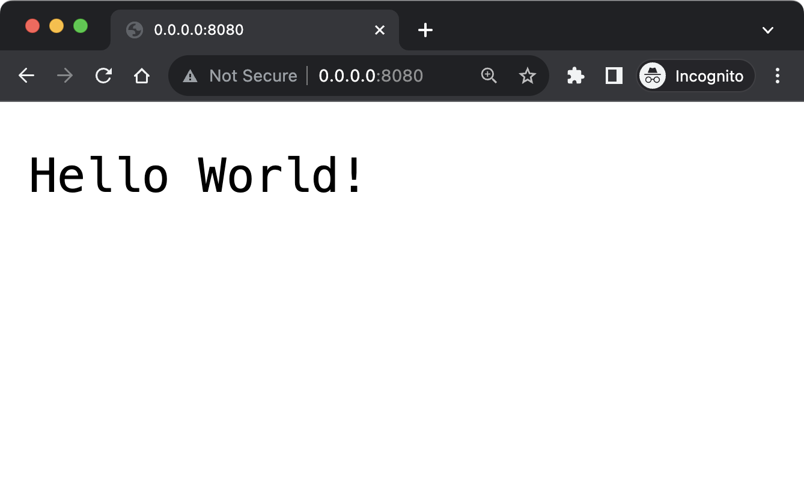

Congratulations! You have successfully started your Ktor project. 

Note that the command line is unresponsive because the underlying process is busy running the Ktor application. You can type `CTRL-C` to cancel the application.

</details>

<details>

<summary> Unpacking and Running the Project on Windows </summary>

### Unpacking and Running the Project on Windows

This is the process to unpack, build and run the project from the command line on Windows. The descriptions below assume that:

1. You have created and downloaded a project called *ktor-sample-app*.
2. This has been placed in a folder called *myprojects* in your home directory.

Please alter the names and paths as required to match your own setup.

Create a folder called *ktor-sample-app* in the current directory and unpack the archive created by the Ktor Project Generator into that folder:

```console
myprojects> mkdir ktor-sample-app
myprojects> tar -xf ktor-sample-app.zip -C ktor-sample-app
```

Change into the new directory and build and run the application:

```console
myprojects> cd ktor-sample-app
ktor-sample-app> .\gradlew.bat build
ktor-sample-app> .\gradlew.bat run
```

The output from the final command should look like this:

```console
ktor-sample-app> Task :run
2023-07-05 16:00:51.735 [main] INFO ktor.application - Autoreload is disabled because the development mode is off.
2023-07-05 16:00:51.966 [main] INFO ktor.application - Application started in 0.256 seconds.
2023-07-05 16:00:52.094 [DefaultDispatcher-worker-1] INFO ktor.application - Responding at http://127.0.0.1:8080
<==========---> 80% EXECUTING [31s]
ktor-sample-app> :run
```

This shows us that the application has started successfully and is running on the current machine. You can verify the project is running by opening a browser at the URL mentioned in the output [http://127.0.0.1:8080](http://127.0.0.1:8080). 

This is what you should see:

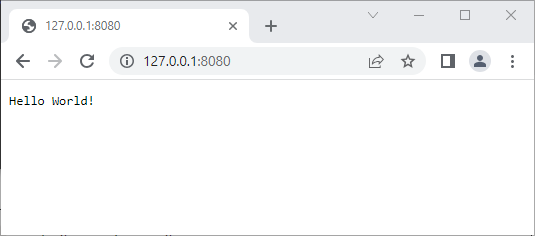

Congratulations! You have successfully started your Ktor project. 

Note that the command line is unresponsive because the underlying process is busy running the Ktor application. You can type `CTRL-C` to cancel the application.

</details>

## Opening, Exploring and Running in IntelliJ IDEA

### Opening the project

If you have IntelliJ IDEA installed you can easily open the project from the command line. Make sure you are in the project folder and then type the `idea` command, followed by a period to represent the current folder:

```console
ktor-sample-app> idea .
```

Alternatively you can launch [IntelliJ IDEA](https://www.jetbrains.com/idea/) yourself and then select the *open* command, either from the Welcome Screen or from the File Menu. You can then navigate to the *ktor-sample-app* folder and select it. See the [IntelliJ IDEA documentation](https://www.jetbrains.com/help/idea/creating-and-managing-projects.html) for more details on managing projects. 

### Exploring the project

Whichever option you choose, the project should open as shown below: 

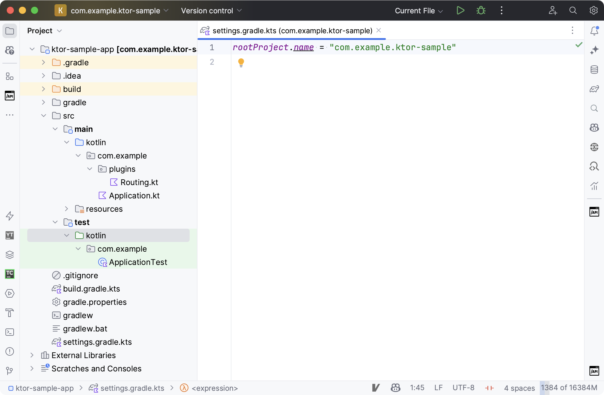

In order to discuss the project layout we have expanded the structure in the Project View and selected the file *settings-gradle.kts*. 

You will see that the code to run your application lives in packages under *src/main/kotlin*. The default package is called *com.example* and contains a subpackage called *plugins*. Two files have been created within these packages, named *Application.kt* and *Routing.kt*:


The name of the project is configured in *settings-gradle.kts*:

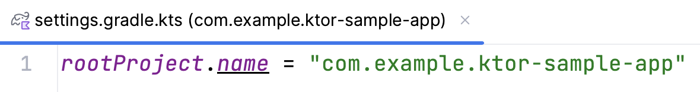

Configuration files, and other kinds of content, live within the  *src/main/resources* folder:

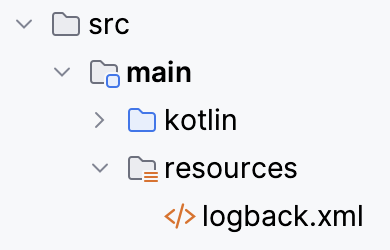

A skeleton test has been created in a package under *src/test/kotlin*:

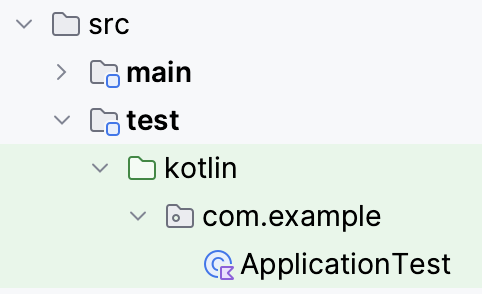

### Running the project

To run the project from within IntelliJ IDEA: 

1. Open the [Gradle Tool Window](https://www.jetbrains.com/help/idea/jetgradle-tool-window.html) by clicking the Elephant Icon on the right hand sidebar. 
2. Within this tool window expand *Tasks* and *application*.
3. Double click on the *run* task. 

Your Ktor application should start in a [Run Tool Window](https://www.jetbrains.com/help/idea/run-tool-window.html) at the bottom of the IDE:

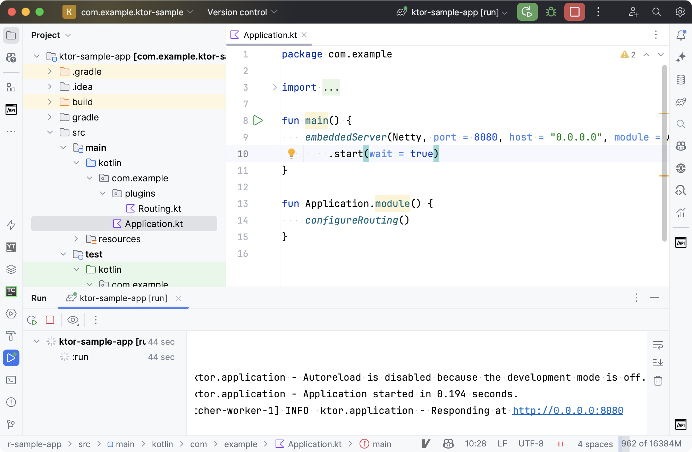

The same messages that we saw on the command line should appear in the window. Once again you can open your browser at the specified URL ([http://0.0.0.0:8080](http://0.0.0.0:8080)) and confirm that the project is running:


You can manage the application via the Run Tool Window. Click on the red box to stop the application and the curved arrow to restart it. These options are explained further in [the IntelliJ IDEA Run Tool Window documentation](https://www.jetbrains.com/help/idea/run-tool-window.html#run-toolbar).

Note that if you try to start a second copy of the application, whilst the first is already running, then the second will be unable to run. This is one of several common errors that developers encounter when beginning to write server-side code. **You can find these errors, plus their resolutions, explained in the Common Problems document.**

## Additional Tasks to Attempt

Here are some additional tasks you may wish to try:

1. Changing the default port.
2. Changing the port via YAML.
3. Adding a new HTTP endpoint.
4. Configuring static content.
5. Writing an integration test.
6. Registering error handlers.

These tasks do not depend on one another, but gradually increase in complexity. Attempting them in the order declared is the easiest way to learn incrementally. For simplicity, and to avoid duplication, the descriptions below assume you are attempting the tasks in order.

Where coding is required we have specified both the code and the corresponding imports. The IDE may add some or all of these imports for you automatically.

### 1. Changing the Default Port

In the Project View navigate to the *src/main/kotlin* folder and then into the single package that has been created for you. Open the *Application.kt* file. You should find code similar to the following:

```kotlin
fun main() {
    embeddedServer(
        Netty, 
        port = 8080, // This is the port on which Ktor is listening
        host = "0.0.0.0", 
        module = Application::module
    ).start(wait = true)
}

fun Application.module() {
    configureRouting()
}
```

Switch the port number to another of your choosing, such as 9292. Restart the application.

You should now find that your application is running under the new port number. You can verify this in the browser, or by [creating a new HTTP Request file](https://www.jetbrains.com/help/idea/http-client-in-product-code-editor.html#creating-http-request-files) in IntelliJ IDEA:

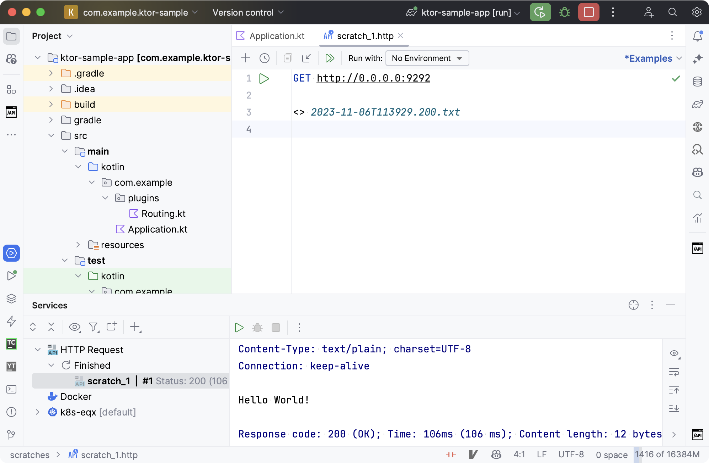

### 2. Changing the Port via YAML
When creating a new project in the Ktor Project Generator there is an option to store configuration externally, within either a YAML or a HOCON file:


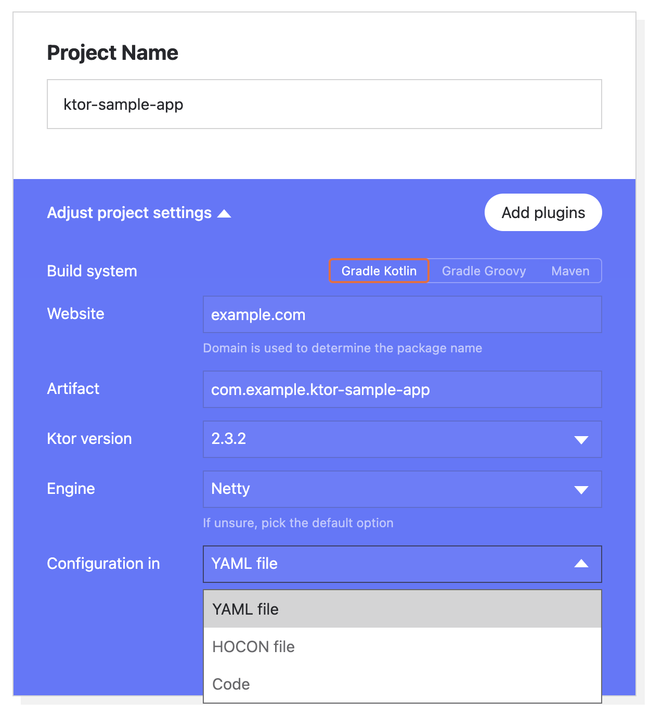

If you had chosen to store configuration externally, then this would be the code in *Application.kt*:

```kotlin
fun main(args: Array<String>): Unit =
io.ktor.server.netty.EngineMain.main(args)


@Suppress("unused")
fun Application.module() {
    configureRouting()
}
```

These would be the values stored in the configuration file (YAML version):

```yaml
ktor:
    application:
        modules:
            - com.example.ApplicationKt.module
    deployment:
        port: 8080
```

In this case you do not need to alter any code to change the port number. Simply alter the value in the YAML or HOCON file and restart the application. The change can be verified in the same way as with Task 1 above.

### 3. Adding a new HTTP Endpoint

Notice the call to configureRouting in the Application.kt file. Navigate to this function by using [the Go To Declaration shortcut](https://www.jetbrains.com/help/idea/navigating-through-the-source-code.html#go_to_declaration) or opening the file *Routing.kt* manually. This is the code you should see:

```kotlin
fun Application.configureRouting() {
    routing {
        get("/") {
            call.respondText("Hello World!")
        }
    }
}
```

Insert the additional five lines of code shown below to create a new endpoint:

<details>

<summary>Imports</summary>

In order to make use of *ContentType* the following import is required. 

```kotlin
import io.ktor.http.*
```

</details>


```kotlin
fun Application.configureRouting() {
    routing {
        get("/") {
            call.respondText("Hello World!")
        }
        // Add the five lines below
        get("/test1") {
            val text = "<h1>Hello From Ktor</h1>"
            val type = ContentType.parse("text/html")
            call.respondText(text, type)
        }
    }
}
```

Note that the */test1* URL can be whatever you like. Restart the application and request the new URL in the browser. The port number you should use will depend on whether you have attempted the first task. You should see the output displayed below:


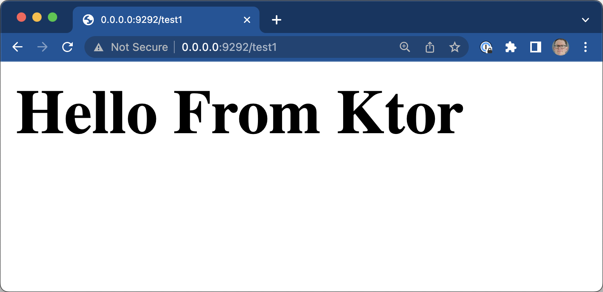

If you have created an HTTP Request File you can also verify the new endpoint there:

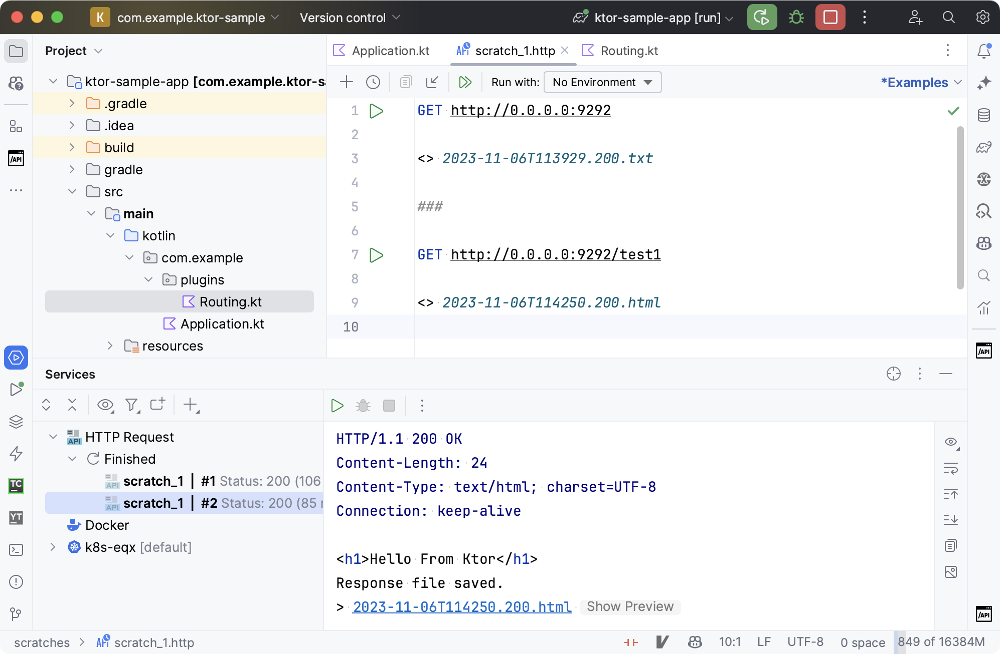

Note that a line containing three hashes is needed to separate different requests.

### 4. Configuring static content

Open the file *Routing.kt*, as in the previous task. Once again this should be the default content:

```kotlin
fun Application.configureRouting() {
    routing {
        get("/") {
            call.respondText("Hello World!")
        }
    }
}
```

Add the following line to the routing section. For this task it does not matter whether or not you have inserted the content for the extra endpoint specified in task (2).

<details>

<summary>Imports</summary>

The following import is required:

```kotlin
import io.ktor.server.http.content.*
```

</details>

```kotlin
fun Application.configureRouting() {
    routing {
        // Add the line below
        staticResources("/content", "mycontent")


        get("/") {
            call.respondText("Hello World!")
        }
    }
}
```

The meaning of this line is as follows:

* Invoking *staticResources* tells Ktor that we want our application to be able to provide standard website content, such as HTML and JavaScript files. Although this content may be executed within the browser, it is considered static from the server's point of view.
* The URL  */content* specifies the path that should be used to fetch this content.
* The path *mycontent* is the name of the folder within which the static content will live. Ktor will look for this folder within the *resources* directory. 


In order to start serving this static content:

1. Right click on the *src/main/resources* folder within the project and create a directory called *mycontent*. Note you could also have used the new items shortcut. 
2. Within this folder right-click (or use the shortcut) and create a web page called *sample.html*. Populate the page with some sample HTML tags.
3. Restart the application.


Your project should now look something like this:

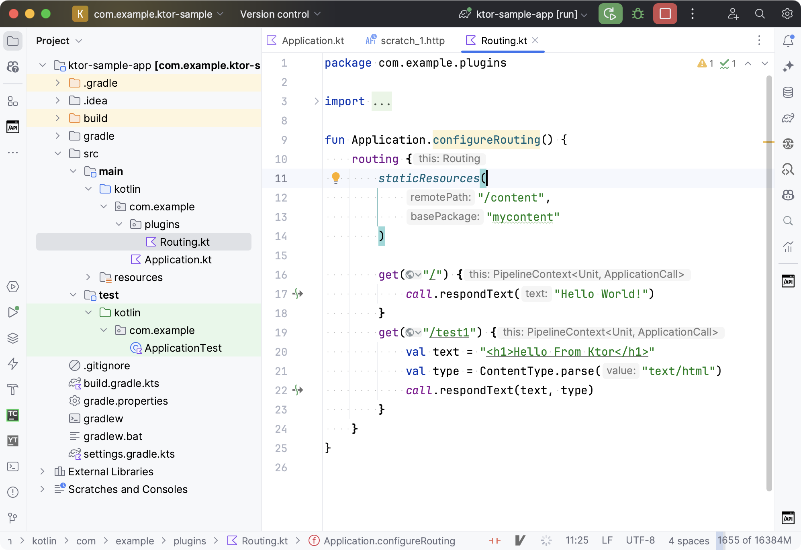

When you open your browser at [http://0.0.0.0:9292/content/sample.html](http://0.0.0.0:9292/content/sample.html) the content of your sample page should be displayed:

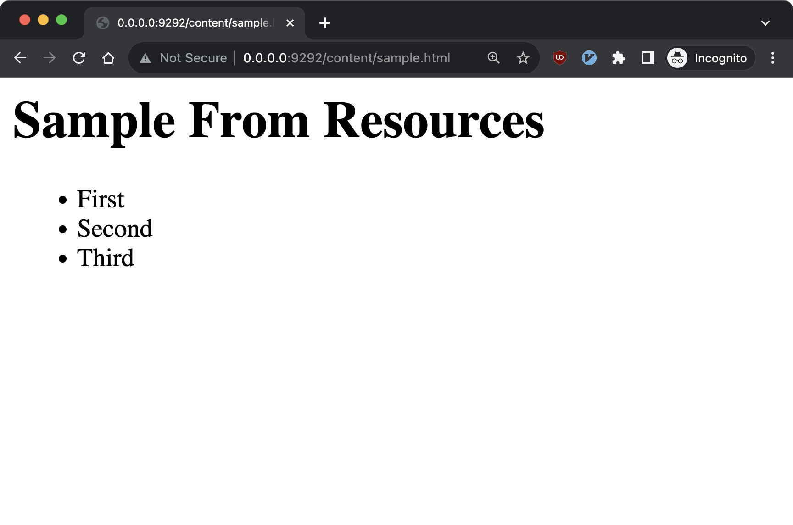

### 5. Writing an integration test
Ktor provides support for creating integration tests, and the Project Generator creates a skeleton test file for you underneath *src/test/kotlin*. Assuming you have accepted the default settings the class will be called *ApplicationTest* and live in the package *com.example*. 

Open the class and add the code below:

<details>

<summary>Imports</summary>

The following imports are required:

```kotlin
import io.ktor.client.request.*
import io.ktor.client.statement.*
import io.ktor.http.*
import io.ktor.server.testing.*
import org.junit.Assert.assertEquals
import org.junit.Test
```

</details>

```kotlin
class ApplicationTest {
    @Test
    fun testRoot() = testApplication {
        application {
            module()
        }


        val response = client.get("/")
        assertEquals(HttpStatusCode.OK, response.status)
        assertEquals("Hello World!", response.bodyAsText())
    }
}
```

The `testApplication` method creates a new instance of Ktor. This instance is running inside a test environment, as opposed to a server like Netty. 

We can then use the `application` method to invoke the same setup functionality that is called from `embeddedServer`. Finally we can use the built-in `client` object and JUnit assertions to send a sample request and check the response.

The test can be run in [any of the standard ways for executing tests](https://www.jetbrains.com/help/idea/performing-tests.html) in IntelliJ IDEA. Note that, because we are running a new instance of Ktor, the success or failure of the test does not depend on whether your application is running at 0.0.0.0. 

If you have successfully completed task (2) then you should be able to add this additional test:

<details>

<summary>Imports</summary>

The following additional import is required:

```kotlin
import kotlin.test.assertContains
```

</details>


```kotlin
@Test
fun testNewEndpoint() = testApplication {
    application {
        module()
    }


    val response = client.get("/test1")
    assertEquals(HttpStatusCode.OK, response.status)
    assertEquals("html", response.contentType()?.contentSubtype)
    assertContains(response.bodyAsText(), "Hello From Ktor")
}
```

### 6. Registering error handlers

We can handle errors in our Ktor application by using the [Status Pages plugin](https://ktor.io/docs/status-pages.html). This plugin is not included in your project by default. We could have added it to our project via the Plugins section in the Ktor Project Generator, or the Project Wizard in IntelliJ IDEA. But for educational purposes we will add and configure the plugin ourselves.

There are four stages to the task

1. Add a new dependency in the Gradle build file.
2. Install the plugin and specify an exception handler.
3. Write sample code to trigger our handler.
4. Restart and invoke our sample code.

#### 1. Add the dependency

In the dependencies section of *build.gradle.kts* add the extra dependency shown below:

```kotlin
dependencies {
    // Our new dependency to be added
    implementation("io.ktor:ktor-server-status-pages:$ktor_version")


    // The existing dependencies
    implementation("io.ktor:ktor-server-core-jvm:$ktor_version")
    implementation("io.ktor:ktor-server-netty-jvm:$ktor_version")
    implementation("ch.qos.logback:logback-classic:$logback_version")
    testImplementation("io.ktor:ktor-server-tests-jvm:$ktor_version")
    testImplementation("org.jetbrains.kotlin:kotlin-test-junit:$kotlin_version")
}
```

When you have done this you will need to [reload the project](https://www.jetbrains.com/help/idea/work-with-gradle-projects.html#gradle_refresh_project) to pick up this new dependency. The shortcut for this is `⇧⌘I`	on MacOS and `Ctrl+Shift+O` on Windows.

#### 2. Install the plugin and specify an exception handler

In the `configureRouting` method in *Routing.kt* add the following five lines of code:

<details>

<summary>Imports</summary>

The following import will be needed:

```kotlin
import io.ktor.server.plugins.statuspages.*
```

</details>


```kotlin
fun Application.configureRouting() {
    //Add the five lines below
    install(StatusPages) {
        exception<IllegalStateException> { call, cause ->
            call.respondText("App in illegal state as ${cause.message}")
        }
    }


    routing {
        get("/") {
            call.respondText("Hello World!")
        }
    }
}
```


These lines install the Status Pages Plugin, and specify what actions to take when an exception of type `IllegalStateException` is thrown. Note we should be setting an HTTP error code in the response, but we will omit this so that the output is displayed directly in the browser.

#### 3. Write sample code to trigger our handler.

Staying within the `configureRouting` method add the additional three lines shown below:

```kotlin
fun Application.configureRouting() {
    install(StatusPages) {
        exception<IllegalStateException> { call, cause ->
            call.respondText("App in illegal state as ${cause.message}")
        }
    }


    routing {
        get("/") {
            call.respondText("Hello World!")
        }
        //Add the three lines below
        get("/error-test") {
            throw IllegalStateException("Too Busy")
        }
    }
}
```

You can see that we have added an endpoint with a URL of */error-test*. When this endpoint is triggered we will throw an exception of the type used in our handler.

#### 4. Restart and invoke our sample code.

Restart the application and, in your browser, navigate to the URL [http://0.0.0.0:9292/error-test](http://0.0.0.0:9292/error-test). You should see that the error message is displayed, as shown below:

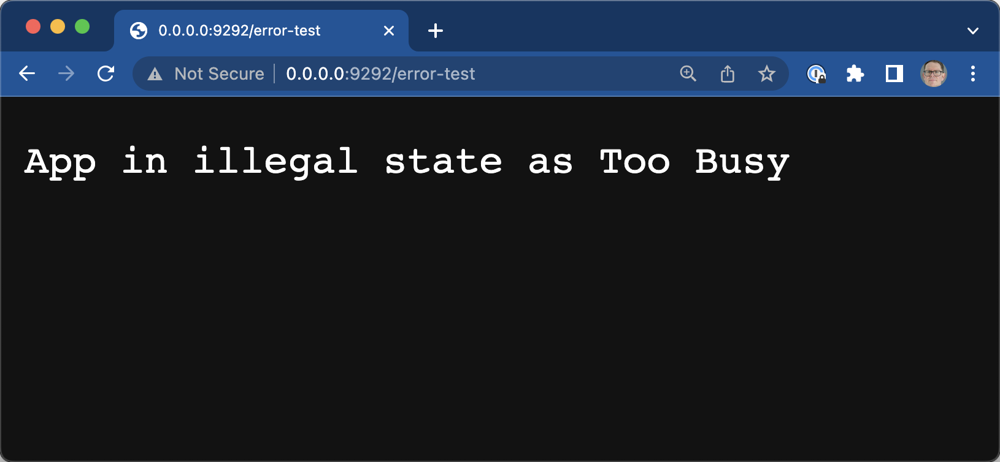


